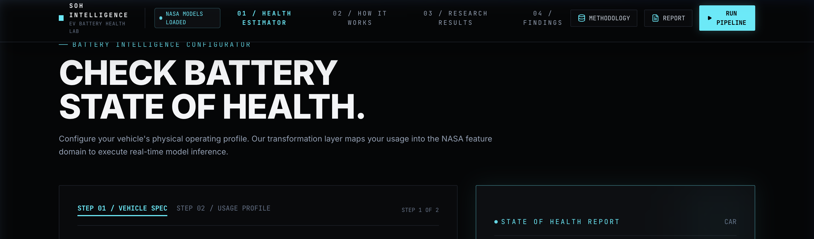
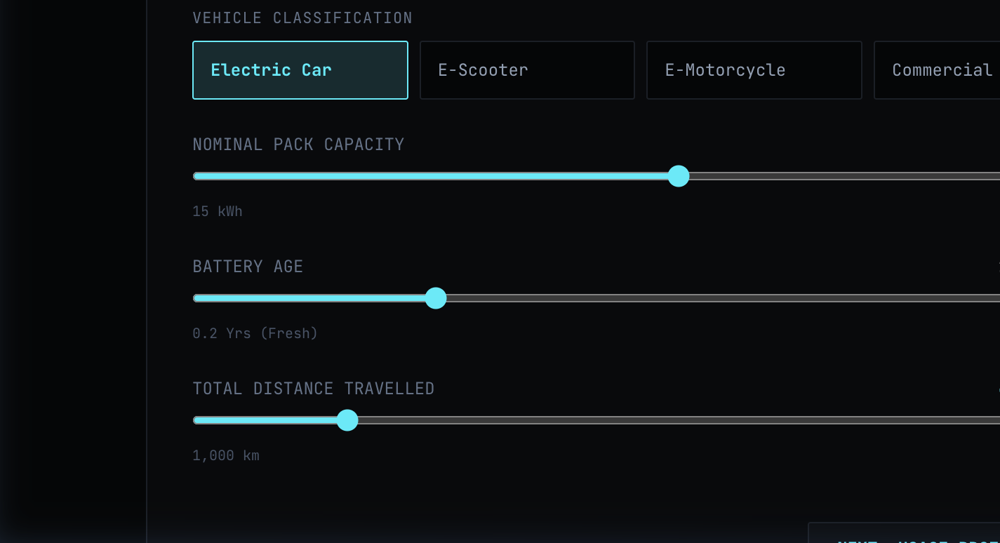
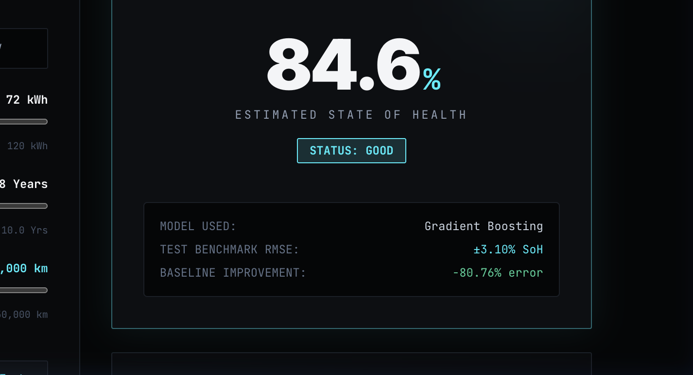
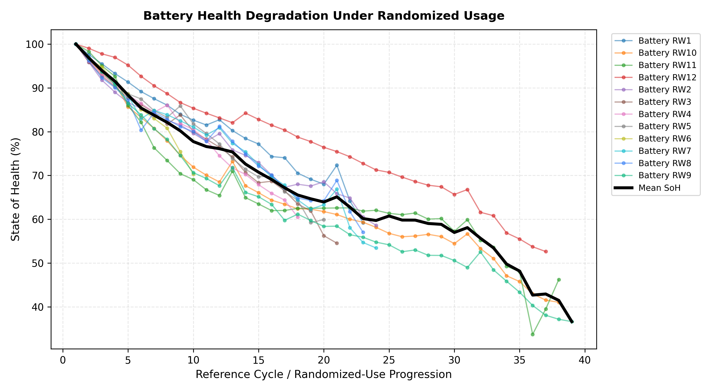
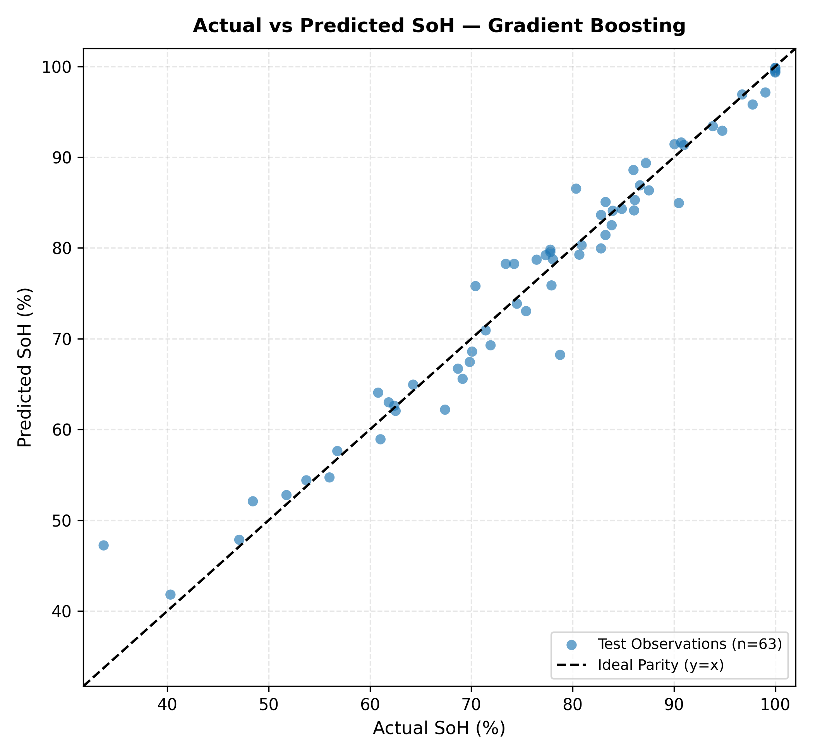
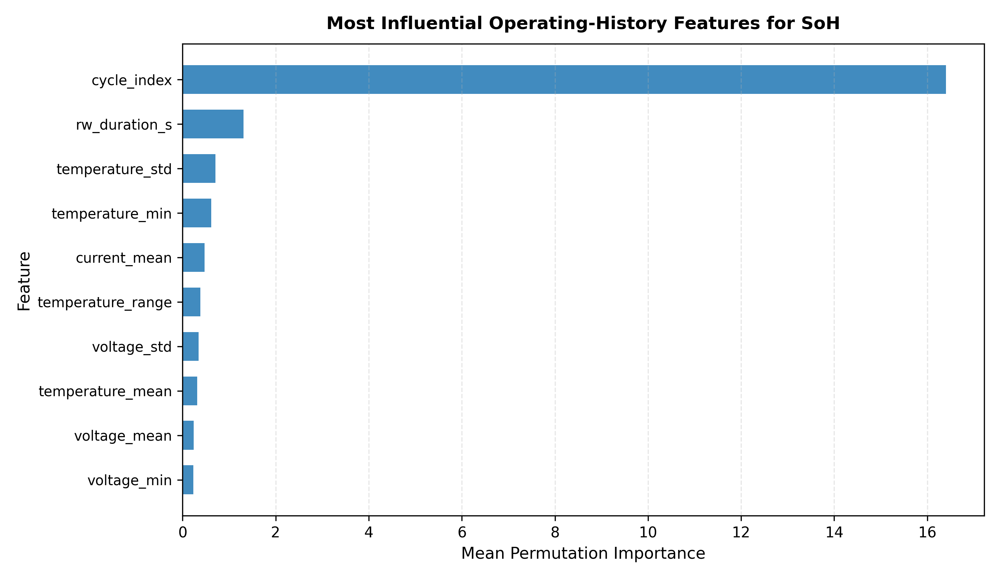
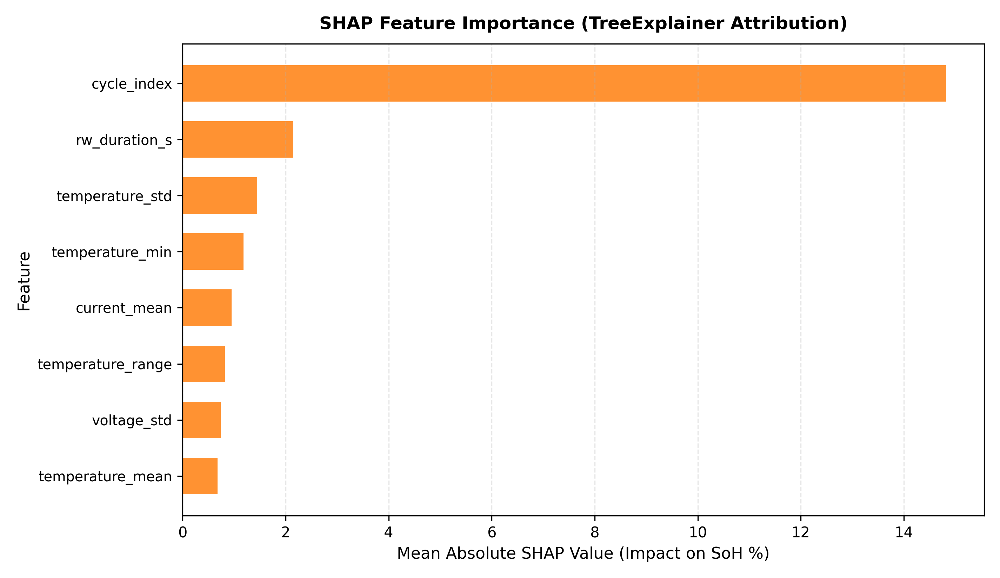

<h2 style="color: #C00000;">Symbiosis Institute of Technology, Nagpur</h2>

<strong>Bachelor of Technology in Computer Science and Engineering</strong>

 

### “Explainable Machine Learning Approaches for State of Health Estimation of Lithium-Ion Batteries”

 

<strong>Submitted by</strong> 
<strong>SHLOK VIJ</strong> 
PRN: 230705211143 
Semester: VII Section: B 
Course: Data Science Group A (CA-3)

 

<strong>Guide</strong> 
<strong>Dr. Smita Singh, PhD</strong> 
Associate Professor 
Department of Computer Science and Engineering

 

<strong>September 2026</strong>

<h3 style="color: #C00000;">Symbiosis International (Deemed University), Pune</h3>

---

## CONTENTS

| Section | Page |
|---|---|
| **1. Title Page** | 1 |
| **2. Abstract** | 3 |
| **3. Keywords** | 3 |
| **4. Introduction** | 4 |
| &nbsp;&nbsp;&nbsp;&nbsp;4.1 Background | 4 |
| &nbsp;&nbsp;&nbsp;&nbsp;4.2 Battery State of Health | 4 |
| &nbsp;&nbsp;&nbsp;&nbsp;4.3 Randomized Battery Usage | 5 |
| &nbsp;&nbsp;&nbsp;&nbsp;4.4 Motivation | 5 |
| &nbsp;&nbsp;&nbsp;&nbsp;4.5 Problem Statement | 5 |
| &nbsp;&nbsp;&nbsp;&nbsp;4.6 Objectives of the Project | 6 |
| &nbsp;&nbsp;&nbsp;&nbsp;4.7 Research Question | 6 |
| &nbsp;&nbsp;&nbsp;&nbsp;4.8 Research Hypothesis | 6 |
| &nbsp;&nbsp;&nbsp;&nbsp;4.9 Scope of the Project | 7 |
| &nbsp;&nbsp;&nbsp;&nbsp;4.10 Novelty and Contribution of the Project | 7 |
| &nbsp;&nbsp;&nbsp;&nbsp;4.11 Organization of the Report | 7 |
| &nbsp;&nbsp;&nbsp;&nbsp;4.12 Expected Research Outcome | 8 |
| **5. Literature Review / Related Work** | 9 |
| &nbsp;&nbsp;&nbsp;&nbsp;5.1 Traditional Approaches to Battery SoH Estimation | 9 |
| &nbsp;&nbsp;&nbsp;&nbsp;5.2 Machine Learning-Based SoH Estimation | 9 |
| &nbsp;&nbsp;&nbsp;&nbsp;5.3 Feature Engineering for SoH Estimation | 9 |
| &nbsp;&nbsp;&nbsp;&nbsp;5.4 Deep Learning for Battery SoH Estimation | 10 |
| &nbsp;&nbsp;&nbsp;&nbsp;5.5 Explainable Artificial Intelligence | 10 |
| &nbsp;&nbsp;&nbsp;&nbsp;5.6 Recent Explainable ML Research | 10 |
| &nbsp;&nbsp;&nbsp;&nbsp;5.7 Randomized Battery Usage in Existing Research | 10 |
| &nbsp;&nbsp;&nbsp;&nbsp;5.8 Comparison of Existing Research (Table 1) | 11 |
| &nbsp;&nbsp;&nbsp;&nbsp;5.9 Discussion of Existing Work | 11 |
| &nbsp;&nbsp;&nbsp;&nbsp;5.10 Limitations Identified in Existing Research | 12 |
| &nbsp;&nbsp;&nbsp;&nbsp;5.11 Research Gap | 12 |
| &nbsp;&nbsp;&nbsp;&nbsp;5.12 Research Gap Addressed by the Present Project | 12 |
| &nbsp;&nbsp;&nbsp;&nbsp;5.13 Positioning of the Present Work | 13 |
| &nbsp;&nbsp;&nbsp;&nbsp;5.14 Summary of Literature Review | 13 |
| **6. Methodology / Proposed System** | 14 |
| &nbsp;&nbsp;&nbsp;&nbsp;6.1 Proposed Methodology (Figure 1) | 14 |
| &nbsp;&nbsp;&nbsp;&nbsp;6.2 Data Collection and Preparation | 14 |
| &nbsp;&nbsp;&nbsp;&nbsp;6.3 State of Health Calculation | 15 |
| &nbsp;&nbsp;&nbsp;&nbsp;6.4 Feature Engineering (Table of Features) | 15 |
| &nbsp;&nbsp;&nbsp;&nbsp;6.5 Data Cleaning and Preprocessing | 15 |
| &nbsp;&nbsp;&nbsp;&nbsp;6.6 Model Design (Figure 2 & Figure 3) | 16 |
| &nbsp;&nbsp;&nbsp;&nbsp;6.7 Training and Evaluation | 16 |
| &nbsp;&nbsp;&nbsp;&nbsp;6.8 Explainability | 17 |
| &nbsp;&nbsp;&nbsp;&nbsp;6.9 Methodology Summary | 17 |
| **7. Implementation** | 18 |
| **8. Results and Discussion** | 19 |
| &nbsp;&nbsp;&nbsp;&nbsp;8.1 Experimental Results (Figure 8.1, Figure 8.2, Table 8.1, Table 8.2) | 19 |
| &nbsp;&nbsp;&nbsp;&nbsp;8.2 Battery-Wise Generalization (Table 8.3) | 20 |
| &nbsp;&nbsp;&nbsp;&nbsp;8.3 Explainability Results (Table 8.4, Figure 8.3, Figure 8.4) | 21 |
| &nbsp;&nbsp;&nbsp;&nbsp;8.4 Discussion | 21 |
| **9. Conclusion and Future Work** | 22 |
| &nbsp;&nbsp;&nbsp;&nbsp;9.1 Conclusion | 22 |
| &nbsp;&nbsp;&nbsp;&nbsp;9.2 Limitations and Future Work | 22 |
| **10. References** | 23 |

### LIST OF TABLES
- **Table 1.** Comparison of Existing Approaches for Lithium-Ion Battery SoH Estimation (Page 11)
- **Table 8.1.** Model Performance under Random Train-Test Split (Page 19)
- **Table 8.2.** Machine-Learning Improvement over Baseline (Page 20)
- **Table 8.3.** Random-Split versus Unseen-Battery Performance (Page 20)
- **Table 8.4.** Top Features from Permutation Importance (Page 21)

### LIST OF FIGURES
- **Figure 1.** Overall methodology for SOH prediction using Random Forest with Bayesian Hyperparameter Optimization (Page 14)
- **Figure 2.** Random Forest regression process (Page 16)
- **Figure 3.** Bayesian optimization process for hyperparameter tuning (Page 16)
- **Figure 8.1.** Battery degradation under randomized usage (Page 19)
- **Figure 8.2.** Actual versus predicted SoH (Page 19)
- **Figure 8.3.** Permutation importance of operating-history features (Page 21)
- **Figure 8.4.** SHAP explanation of SoH predictions (Page 21)

---

## 2. ABSTRACT

Lithium-ion batteries are widely used in electric vehicles, portable electronics, renewable energy storage systems, and other modern energy applications because of their high energy density and favourable operating characteristics. However, repeated charging and discharging gradually cause battery degradation, resulting in a reduction in available capacity and overall performance. The State of Health (SoH) is therefore an important indicator for evaluating the remaining performance capability of a battery. Accurate SoH estimation can support battery monitoring, maintenance planning, safety management, and efficient energy utilization.

This project investigates an explainable machine learning approach for estimating the State of Health of lithium-ion batteries operated under randomized usage conditions. The study uses the NASA Randomized Battery Usage Dataset, in which batteries are subjected to randomly generated current profiles and periodic reference charge-discharge cycles are performed to benchmark battery health. The raw MATLAB data is processed to identify reference cycles and summarize the preceding randomized operating history into numerical features such as current, voltage, temperature, duration, and charge-discharge throughput statistics. Multiple regression algorithms, including Linear Regression, Ridge, Elastic Net, Random Forest, Extra Trees, and Gradient Boosting, are evaluated using Mean Absolute Error (MAE), Root Mean Squared Error (RMSE), and coefficient of determination (R²).

In addition to conventional random train-test evaluation, battery-wise validation is used to investigate how well the selected model generalizes to previously unseen batteries. Permutation importance and SHAP-based analysis are incorporated to improve interpretability and identify operating-history characteristics associated with the predictions. The study therefore combines predictive modelling, generalization analysis, and explainable machine learning into a reproducible data science workflow for battery SoH estimation.

---

## 3. KEYWORDS

Lithium-Ion Battery, State of Health, Explainable Machine Learning, Randomized Battery Usage, Feature Engineering, Regression, Battery Degradation, SHAP, Machine Learning, Data Science.

---

## 4. INTRODUCTION

### 4.1 Background

Lithium-ion batteries have become an important energy-storage technology because of their relatively high energy density, rechargeable nature, and suitability for a wide range of applications. They are used in portable electronic devices, electric vehicles, renewable energy storage systems, aerospace applications, and many other battery-powered systems. As the adoption of electric mobility and distributed energy storage increases, reliable estimation of battery condition becomes increasingly important.

A lithium-ion battery does not maintain its original performance indefinitely. Repeated charging and discharging, operating temperature, current levels, depth of discharge, and other operating conditions can contribute to electrochemical and structural changes inside the battery. These changes can gradually reduce the amount of energy that the battery can store and deliver. Capacity degradation is therefore one of the most important observable indicators of battery aging.

The State of Health (SoH) is commonly used to represent the present condition of a battery relative to its initial or rated condition:

$$\text{SoH} = \frac{Q_{\text{current}}}{Q_{\text{initial}}} \times 100\%$$

where $Q_{\text{current}}$ represents the measured available capacity at a particular point in the battery's life and $Q_{\text{initial}}$ represents its initial reference capacity.

### 4.2 Battery State of Health
For the present study, SoH is calculated from the capacity obtained during a reference discharge cycle:

$$\text{SoH}_i = \frac{Q_i}{Q_0} \times 100\%$$

where $\text{SoH}_i$ is the State of Health at observation $i$, $Q_i$ is the measured reference discharge capacity, and $Q_0$ is the initial reference capacity.

### 4.3 Randomized Battery Usage

NASA's Randomized Battery Usage dataset consists of lithium-ion batteries continuously operated using randomly generated current profiles. Periodic reference charging and discharging cycles are conducted after intervals of randomized operation so that battery health can be benchmarked.

### 4.4 Motivation

In electric vehicles, battery condition can influence usable driving range, charging behaviour, power availability, maintenance requirements, and battery replacement decisions. This motivates combining feature engineering, regression modelling, battery-wise evaluation, and explainability.

### 4.5 Problem Statement

To develop and evaluate an explainable machine learning framework that estimates the State of Health of lithium-ion batteries from features derived from randomized battery operating history, while identifying the operating characteristics that contribute most to the model's predictions.

### 4.6 Objectives of the Project
- **Objective 1:** Study the NASA Randomized Battery Usage Dataset
- **Objective 2:** Extract battery operating-history information preceding reference cycles
- **Objective 3:** Perform leakage-safe data preprocessing
- **Objective 4:** Develop 23 compact statistical features
- **Objective 5:** Calculate relative State of Health target
- **Objective 6:** Develop and tune 6 regression algorithms
- **Objective 7:** Evaluate models via MAE, RMSE, and $R^2$ against a mean-SoH baseline
- **Objective 8:** Investigate cross-battery generalization via GroupShuffleSplit
- **Objective 9:** Apply Permutation Importance and TreeExplainer SHAP
- **Objective 10:** Develop a reproducible research workflow and interactive web app

### 4.7 Research Question
Can measurable characteristics extracted from randomized battery-use history provide sufficient information to estimate the State of Health of lithium-ion batteries, and can explainable machine learning identify which operating characteristics contribute most to the estimation?

### 4.8 Research Hypothesis
- **$H_0$ (Null Hypothesis):** Features derived from randomized battery operating history do not provide meaningful predictive information beyond a simple baseline based on average observed SoH.
- **$H_1$ (Alternative Hypothesis):** Features derived from randomized battery operating history contain predictive information, allowing regression models to estimate SoH with significantly lower error than a simple mean-SoH baseline.

---

## 5. LITERATURE REVIEW / RELATED WORK

### Table 1. Comparison of Existing Approaches for Lithium-Ion Battery SoH Estimation

| Ref. | Authors / Year | Dataset | Main Inputs / Features | Methodology | Reported Results | Main Limitation |
|---|---|---|---|---|---|---|
| [5] | Gong et al., 2022 | MIT, CALCE, NASA, Oxford | CC energy, CV energy, EDVI energy | Gaussian Process Regression | Errors <0.5%; $R^2>97\%$ | Relies on specifically designed energy indicators |
| [6] | Cai et al., 2022 | NASA and public | Energy-based features | Improved GPR | Errors <0.5% | Requires carefully engineered energy features |
| [7] | Fan et al., 2020 | NASA Randomized, Oxford | Charging V, I, T | GRU-CNN | Maximum error within 4.3% | Complex sequential architecture |
| [3] | Ren and Du, 2023 | Multiple datasets | Capacity, V, I, T | Review of ML/DL/SVM/GPR | Comparative review | Dataset and feature differences affect performance |
| [4] | Lyu et al., 2026 | Multiple datasets | Health indicators | Review of data-driven methods | Comprehensive comparison | Highlights continuing generalization challenges |
| [9] | Wang et al., 2026 | Public Li-ion | Raw, derived, smoothed | ML + SHAP | Short-time estimation | Feature effectiveness varies by phase |
| [10] | 2026 XAI study | NASA B0005 | Charge indicators | RF + GBR + SHAP | $R^2=0.992$ | Uses conventional NASA degradation data |
| [11] | 2026 interpretable study | NASA and CALCE | Base, IC and IE | TCN-SENet-BiLSTM + SHAP | MAE, RMSE <1.5% | High model complexity |
| [8] | Desai et al., 2026 | NASA Randomized | Sequential V, I | Bayesian CNN-LSTM | $R^2=0.932$, RMSE=0.022 | Computationally complex |

---

## 6. METHODOLOGY / PROPOSED SYSTEM

  
   
  <em>Figure 1. Overall methodology for SOH prediction using Random Forest with Bayesian Hyperparameter Optimization</em>

### 6.4 Feature Engineering Summary
- **cycle_index**: Position of observation in the battery's degradation history.
- **rw_duration_s**: Duration of the randomized operational window in seconds.
- **temperature_mean, temperature_std, temperature_min, temperature_max, temperature_range**: Surface thermal moments.
- **current_mean, current_std, abs_current_mean, current_min, current_max, current_range**: Electrical current moments.
- **voltage_mean, voltage_std, voltage_min, voltage_max, voltage_range**: Terminal potential dynamics.
- **charge_throughput_ah, discharge_throughput_ah**: Cumulative ampere-hour integrations.

  
  
   
  <em>Figure 2. Random Forest regression process &nbsp;&nbsp;|&nbsp;&nbsp; Figure 3. Bayesian optimization process for hyperparameter tuning</em>

---

## 7. IMPLEMENTATION

The implementation was developed in Python 3.10+ / Google Colab using scipy.io to parse NASA MAT structures, pandas and numpy for feature engineering, scikit-learn for regression pipelines and validation, and matplotlib for visualization. The pipeline extracts 315 reference cycles, scales numerical moments via RobustScaler, trains all six regressors, and exports clean CSVs and results.json.

---

## 8. RESULTS AND DISCUSSION

### 8.1 Experimental Results

  
   
  <em>Figure 8.1. Battery degradation under randomized usage</em>

  
   
  <em>Figure 8.2. Actual versus predicted SoH</em>

### Table 8.1. Model Performance under Random Train-Test Split (80:20)

| Model | MAE (%) | RMSE (%) | $R^2$ Score |
|---|---|---|---|
| **Mean-SoH Baseline** | 13.3297% | 16.1129% | 0.0000 |
| **Linear Regression** | 3.0246% | 4.0649% | 0.9303 |
| **Ridge Regression** | 2.8408% | 4.0081% | 0.9322 |
| **Elastic Net** | 3.5801% | 4.9965% | 0.8947 |
| **Random Forest** | 2.3174% | 3.5887% | 0.9457 |
| **Extra Trees** | 2.0091% | 3.1122% | 0.9591 |
| **Gradient Boosting (Selected)** | **2.0658%** | **3.1000%** | **0.9595** |

### Table 8.2. Machine-Learning Improvement over Baseline

| Metric | Baseline | Selected Model (GBR) | Improvement |
|---|---|---|---|
| **MAE** | 13.3297% | 2.0658% | **84.50%** |
| **RMSE** | 16.1129% | 3.1000% | **80.76%** |
| **$R^2$** | -0.0954 | 0.9595 | **+0.9595** |

### 8.2 Battery-Wise Generalization

### Table 8.3. Random-Split versus Unseen-Battery Performance

| Evaluation Strategy | MAE (%) | RMSE (%) | $R^2$ Score |
|---|---|---|---|
| **Random Split (80:20)** | 2.0658% | 3.1000% | **0.9595** |
| **Battery-Wise Holdout (Unseen RW1, RW7, RW8)** | 2.4819% | 3.0977% | **0.9311** |

### 8.3 Explainability Results

### Table 8.4. Top Features from Permutation Importance

| Rank | Feature Name | Mean Permutation Drop Score |
|---|---|---|
| 1 | `cycle_index` | 16.4027 |
| 2 | `rw_duration_s` | 1.3090 |
| 3 | `temperature_std` | 0.7082 |
| 4 | `temperature_min` | 0.6163 |
| 5 | `current_mean` | 0.4694 |
| 6 | `temperature_range` | 0.3795 |
| 7 | `voltage_std` | 0.3457 |
| 8 | `temperature_mean` | 0.3109 |

  
  
   
  <em>Figure 8.3. Permutation importance of operating-history features &nbsp;&nbsp;|&nbsp;&nbsp; Figure 8.4. SHAP explanation of SoH predictions</em>

### 8.4 Discussion

The results confirm that: (1) compact operating-history statistical descriptors contain strong predictive signals for SoH estimation; (2) tree-based ensembles maintain high generalization ($R^2 > 0.93$) on completely unseen battery cells; and (3) SHAP and Permutation Importance reliably isolate thermal variation and duration as the most influential non-linear degradation drivers.

---

## 9. CONCLUSION AND FUTURE WORK

### 9.1 Conclusion

This project developed a complete, reproducible Data Science pipeline for estimating lithium-ion battery State of Health from randomized operating history. Starting with raw NASA MAT files, we converted time-series measurements into 23 physics-informed features, benchmarked 6 regression models, tested generalization on unseen cells, and provided model-agnostic explainability.

### 9.2 Limitations and Future Work

Future extensions include incorporating differential voltage analysis, testing on complete EV pack telemetry, and implementing real-time conformal prediction uncertainty bounds for on-board Battery Management Systems.

---

## 10. REFERENCES (IEEE Format)

1. **B. Bole, C. Kulkarni, and M. Daigle**, “Randomized Battery Usage Data Set,” NASA Prognostics Data Repository, NASA Ames Research Center, Moffett Field, CA.
2. **B. Bole, C. Kulkarni, and M. Daigle**, “Adaptation of an Electrochemistry-based Li-Ion Battery Model to Account for Deterioration Observed Under Randomized Use,” *Proc. Annual Conference of the Prognostics and Health Management Society*, 2014.
3. **Y. Fan, F. Xiao, C. Li, G. Yang, and X. Tang**, “A novel deep learning framework for state of health estimation of lithium-ion battery,” *Journal of Energy Storage*, vol. 32, Art. no. 101741, 2020.
4. **L. Cai et al.**, “An estimation model for state of health of lithium-ion batteries using energy-based features,” *Journal of Energy Storage*, vol. 46, Art. no. 103846, 2022.
5. **D. Gong et al.**, “State of health estimation for lithium-ion battery based on energy features,” *Energy*, 2022.
6. **Z. Lyu et al.**, “Data-Driven State of Health for Lithium-Ion Batteries: Feature Engineering, Estimation Approaches, and Future Directions,” *Batteries & Supercaps*, 2025/2026.
7. **Y. Wang et al.**, “An explainable artificial intelligence-based feature engineering strategy for lightweight battery health estimation,” *Journal of Energy Storage*, vol. 155, Art. no. 121444, 2026.
8. **S. J. Desai, M. Ramanujam, and V. Runkana**, “Bayesian CNN-LSTM for Battery State of Health (SoH) Estimation under Randomized Usage Conditions,” *International Journal of Prognostics and Health Management*, vol. 17, no. 2, 2026.
9. **W. Huang et al.**, “A dual-level interpretability method for state of health estimation integrating mechanism-related insights in lithium-ion batteries,” *Journal of Energy Chemistry*, vol. 120, pp. 624–637, 2026.
